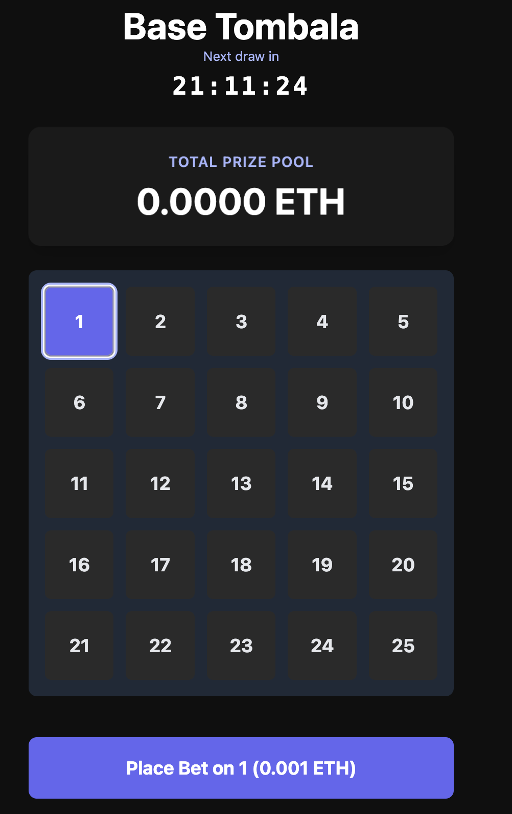

# Base Tombala - Decentralized Turkish Bingo on Base

Welcome to Base Tombala, a modern, decentralized take on the classic Turkish Bingo game, built on the Base blockchain and integrated as a Farcaster Mini App. This project leverages the power of smart contracts to create a fair, transparent, and engaging gaming experience where players can win ETH prizes.



## 🚀 Features

-   **Fully Decentralized**: All game logic is managed by a smart contract on the Base blockchain, ensuring transparency and fairness.
-   **Farcaster Mini App**: Seamlessly integrated into the Farcaster ecosystem for easy access and social sharing.
-   **Automated 24-Hour Draws**: The smart contract automatically conducts a draw every 24 hours.
-   **Charitable Giving**: A portion of the prize pool is set aside for donations to charitable foundations.
-   **Real-Time On-Chain Data**: The frontend reflects the game's state in real-time using modern Web3 hooks.
-   **Mobile-First Design**: A responsive and intuitive user interface optimized for mobile and Mini App environments.

## 🎮 How to Play

1.  **Connect Your Wallet**: Access the game through a Farcaster client and connect your wallet.
2.  **Choose a Number**: Select an available number from the 1-25 grid.
3.  **Place Your Bet**: Secure your chosen number by placing a bet (e.g., 0.001 ETH).
4.  **Wait for the Draw**: A new winner is drawn automatically every 24 hours.
5.  **Win & Contribute**: If your number is drawn, you win a majority of the prize pool, and a portion is allocated to the charity fund.

## 💰 Prize Distribution & Charity

Our prize model is designed to be both rewarding and impactful.

-   **Winner's Share (90%)**: The lucky winner of each round receives 90% of the total prize pool.
-   **Charity Fund (10%)**: The remaining 10% of the prize pool is transferred to a separate treasury. This fund will accumulate over time.
-   **Donation Goal**: Once the charity fund reaches a predetermined threshold, the accumulated amount will be donated to registered charitable foundations. This process will be executed transparently on-chain.

## 🛠️ Tech Stack

-   **Frontend**: Next.js, React, TypeScript, Tailwind CSS
-   **Blockchain**: Solidity, Hardhat
-   **Web3 Integration**: Wagmi, Viem, Ethers.js
-   **Farcaster**: `@farcaster/miniapp-sdk` for Mini App integration.
-   **Deployment**: Vercel for the frontend and automated cron jobs for contract interactions.

## 📄 Smart Contract

The `Tombala.sol` contract is the core of the game. It is responsible for:

-   Managing player bets and number selections.
-   Securely holding the prize pool.
-   Executing fair and random draws.
-   Distributing the prize pool according to the 90/10 split.
-   Managing the game's lifecycle, including starting new rounds.

### Contract Address (Base Sepolia)

`0xbf60e7f890329cdA4FE04F01cBF4686B4fEe8f73`

## 🚀 Getting Started

Follow these steps to set up and run the project locally.

### Prerequisites

-   Node.js (v18 or higher)
-   npm, pnpm, or yarn
-   Git

### 1. Clone the Repository

```bash
git clone https://github.com/Zireaelst/base-workshop.git
cd base-workshop/my-minikit-app
```

### 2. Install Dependencies

```bash
npm install
```

### 3. Set Up Environment Variables

Copy the example environment file and fill in the required values.

```bash
cp .env.example .env
```

You will need to provide:

-   `PRIVATE_KEY`: Your wallet's private key for deploying the contract.
-   `NEXT_PUBLIC_ONCHAINKIT_API_KEY`: Your API key from OnChainKit.
-   Contract addresses after deployment.

### 4. Deploy the Smart Contract

Deploy the contract to the Base Sepolia test network.

```bash
npx hardhat run scripts/deploy.js --network base-sepolia
```

After deployment, copy the new contract address into your `.env` file.

### 5. Run the Development Server

```bash
npm run dev
```

The application will be available at `http://localhost:3000`.